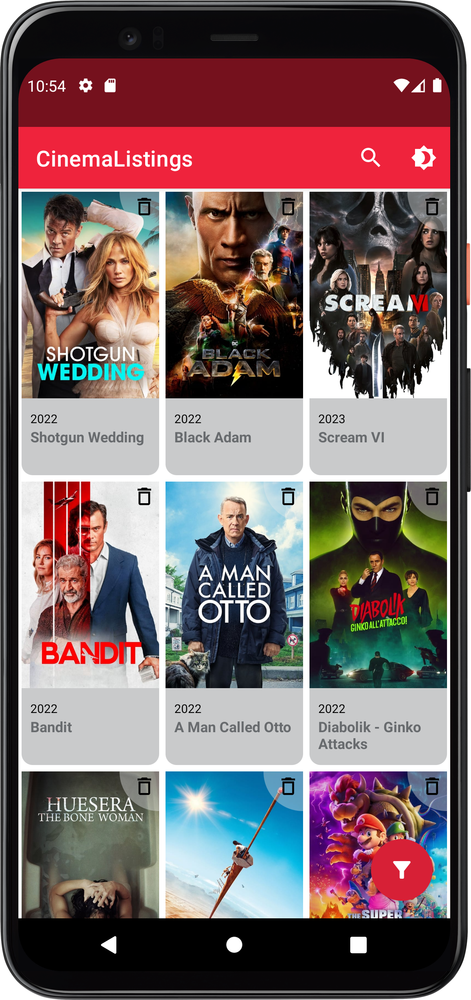
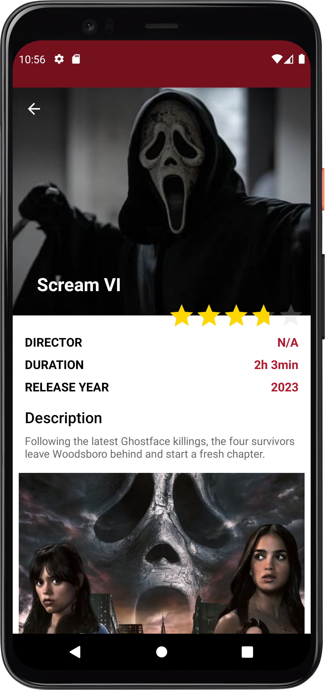
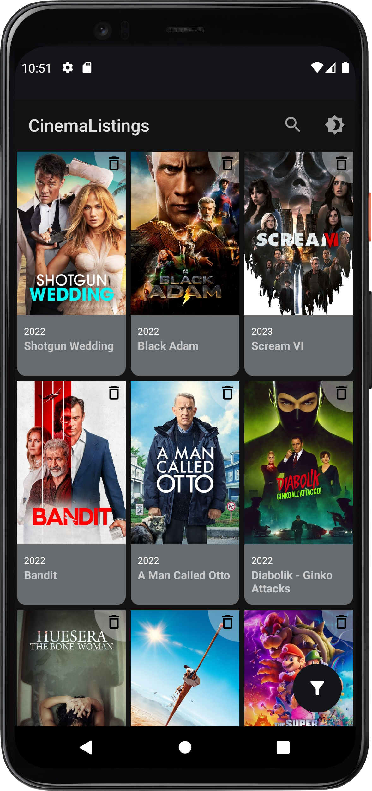
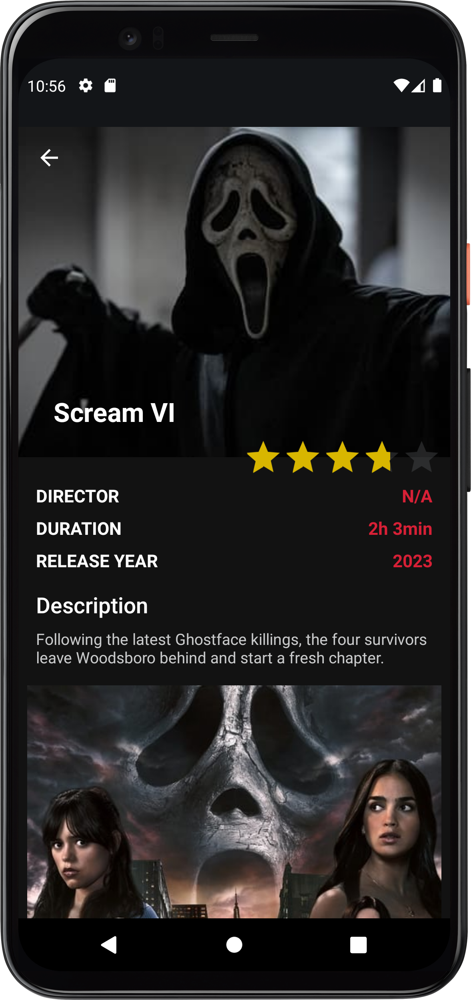

# [CinemaListings](https://github.com/javiergbravo/CinemaListings)

## 🌟 About

It simply app that loads a billboard from TheMovieDatabase Api and display inside a RecyclerView as
a GridLayout. This repository shows a clean code with MVVM architecture and use professional
libraries with Kotlin language. Different models are used for each architecture layer with mappers
whose work is transforming the objects to the next layer. Each layer is represented by a module and
also exist a core module to be the base of app modules.

 
  

## 📜 Screenshots

   
   

## 📜 Project requirements

### Instructions

To launch the application you need to get an API key from [TheMovieDb](https://www.themoviedb.org),
(registration is required). You need to create file named *secrets.properties* like *
secrets.defaults.properties* file, and put your api key inside like this:

`THEMOVIEDB_API_KEY="your_api_key"`

## 📚 Libraries used

- [Kotlin](https://kotlinlang.org/) - First class and official programming language for Android
  development.
- [Coroutines](https://kotlinlang.org/docs/reference/coroutines-overview.html) - For asynchronous
  and more.
- [Glide](https://bumptech.github.io/glide) - An image loading library for Android.
- [Material Components for Android](https://github.com/material-components/material-components-android)
    - Modular and customizable Material Design UI components for Android.
- [Android Architecture Components](https://developer.android.com/topic/libraries/architecture) -
  Collection of libraries that help you design robust, testable, and maintainable apps.
    - [StateFlow](https://developer.android.com/kotlin/flow/stateflow-and-sharedflow) - Data objects
      that notify views when the underlying database changes.
    - [ViewModel](https://developer.android.com/topic/libraries/architecture/viewmodel) - Stores
      UI-related data that isn't destroyed on UI changes.
    - [ViewBinding](https://developer.android.com/topic/libraries/view-binding) - Generates a
      binding class for each XML layout file present in that module and allows you to more easily
      write code that interacts with views.
- [Moshi](https://github.com/square/moshi) - Library that can be used to convert Java Objects into
  their JSON representation and JSON string to an equivalent Java object.
- [OkHttpClient](https://square.github.io/okhttp) - HTTP client that allows all requests to the same
  host to share a socket and response caching avoids the network completely for repeat request.
- [Retrofit](https://square.github.io/retrofit) - Turns HTTP API into a Java interface.
- [Dagger 2](https://dagger.dev/) - Dependency Injection Framework.
- [Hilt](https://developer.android.com/training/dependency-injection/hilt-android) - Jetpack
  Dependency Injection Framework.

## 📁 Modules

Modules have been created to respect the layers of the architecture. First there are 3 main modules:
data, domain and presentation*. At the same time, the project has 4 more modules, with prefix '
core', where provide the base of app layers, and there are one 'commons' module that provide some
features to the rest of modules.

*Note: Presentation module is called 'App'

| Module name       | Type                | Modules visibility                       | Description                                                              |
|-------------------|---------------------|------------------------------------------|--------------------------------------------------------------------------|
| core-commons      | Java/Kotlin Library | -                                        | Commons resources and classes that can be used in different applications |
| core-presentation | Java/Kotlin Library | :core-commons                            | Base activity, adapters, managers to presentation layer                  |
| core-data-remote  | Java/Kotlin Library | :core-commons                            | Base remote data sources                                                 |
| app               | Android Application | :core-commons :core-presentation :domain | Ui and base application features                                         |
| domain            | Java/Kotlin Library | :core-commons :data                      | Use-cases                                                                |
| data              | Java/Kotlin Library | :core-commons :data-remote               | Repositories                                                             | 
| data-remote       | Java/Kotlin Library | :core-commons :core-data-remote          | Remote data sources (network)                                            |

## 📝 Test

This project has test inside *:app* and *:data-remote* modules.

Inside *:app* are tested some cases of ViewModels, and also filters are tested:

- **MovieFiltersTest** to check if the release year of movies is filtered correctly.
- **BillboardViewModelTest** to check pagination, loading state and errors.
- **MovieDetailsViewModelTest** to check success, loading and error states.

Inside *:data-remote* there are different tests:

- **MoshiAdapterTest** to check if the date is parsed correctly.
- **DateTest** to check if the date is mapped correctly by SimpleDateAdapter and by custom extension
  function.
- **TheMovieDbApiServiceTest** to check errors when api key is not implemented.
- **TheMovieDbMockApiTest** to check data source with mock responses.

## Extras

- [x] [Github Actions](https://github.com/features/actions) - The project uses GitHub actions for CI
  operations such as running automated
  build and test.
- [x] [Renovate](https://github.com/apps/renovate) - The project uses Renovate bot to keep
  dependencies up to date.
- [x] [Proguard](https://developer.android.com/studio/build/shrink-code) Obfuscation code in release
  build implemented *(but not tested)*
